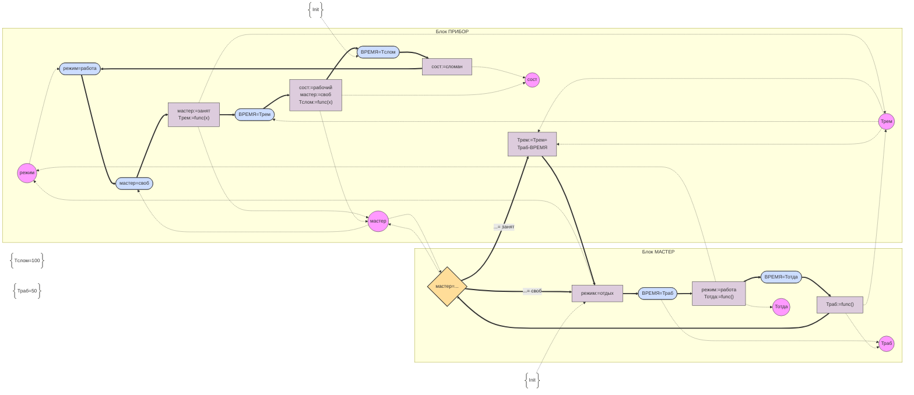

# Орлова Анна ИУ5-61Б схема

```mermaid
flowchart LR
%% ОБЩИЕ ПАРАМЕТРЫ
par1((режим))
par2((мастер))
par4((Трем))
%% ПОДГРАФ: ПРИБОР
subgraph Equip["Блок ПРИБОР"]
    direction LR
    p1(["ВРЕМЯ=Tслом"]) ==> p2["сост:=сломан"]
    p2 ==> p3(["режим=работа"])
    p3 ==> p4(["мастер=своб"])
    p4 ==> p5["мастер:=занят<br>Tрем:=func(x)"]
    p5 ==> p6(["ВРЕМЯ=Трем"])
    p6 ==> p7["сост:=рабочий<br>мастер:=своб<br>Tслом:=func(x)"]
    p7 ==> p1
    par4 -.-> m7 
    par3((сост))
    p2 -.-> par3
    p7 -.-> par3
    par1 -.-> p3
    par2 -.-> p4
    p5 -.-> par2
    p7 -.-> par2
    p5 -.-> par4
    par4 -.-> p6
    classDef operator fill:#dcd,stroke:#333,stroke-width:1px;
    classDef condition fill:#cdf,stroke:#333,stroke-width:1px;
    class p1,p3,p4,p6 condition;
    class p2,p5,p7 operator;
end
%% ПОДГРАФ: МАСТЕР
subgraph Master["Блок МАСТЕР"]
    direction LR
    m1["режим:=отдых"] ==> m2(["ВРЕМЯ=Траб"])
    m2 ==> m3["режим:=работа<br>Тотда:=func()"]
    m3 ==> m4(["ВРЕМЯ=Тотда"])
    m4 ==> m5["Траб:=func()"]
    m5 ==> m6{"мастер=..."}

    m6 ==>|"...= занят"| m7["Трем:=Трем+<br>Траб-ВРЕМЯ"]
    m7==>m1
    m6 ==>|"...= своб"| m1
    
    par5((Тотда))
    par6((Траб))
    
    m1 -.-> par1
    m3 -.-> par1
    m6 -.-> par2
    par2 -.-> m6
    m5 -.-> par4
    par4 -.-> m7
    m3 -.-> par5
    m2 -.-> par6
    m5 -.-> par6
    
    classDef operator fill:#dcd,stroke:#333,stroke-width:1px;
    classDef condition fill:#cdf,stroke:#333,stroke-width:1px;
    classDef navig fill:#fd9,stroke:#333,stroke-width:2px;
    class m1,m3,m5,m7 operator;
    class m2,m4 condition;
    class m6 navig;
end

%% ИНИЦИАТОРЫ
InitE@{shape: braces, label: "Init"} -.-> p1
HTfE@{shape: braces, label: "Tслом=100"}
InitM@{shape: braces, label: "Init"} -.-> m1
HTfM@{shape: braces, label: "Tраб=50"}

%% ОБЩИЕ СТИЛИ
classDef param fill:#f9f,stroke:#333,stroke-width:1px;
classDef init fill:#ff0,stroke:#333,stroke-width:1px;
classDef endParam fill:#ccc,stroke:#333,stroke-width:1px;

class par1,par2,par3,par4,par5,par6 param;
class InitE,InitM,HTfE,HTfM init;
class m8 endParam;

%% ССЫЛКИ
click par2 href "https://iu5.bmstu.ru" "Параметр: мастер" _blank;
click par4 href "https://iu5.bmstu.ru" "Параметр: Трем" _blank;

```
